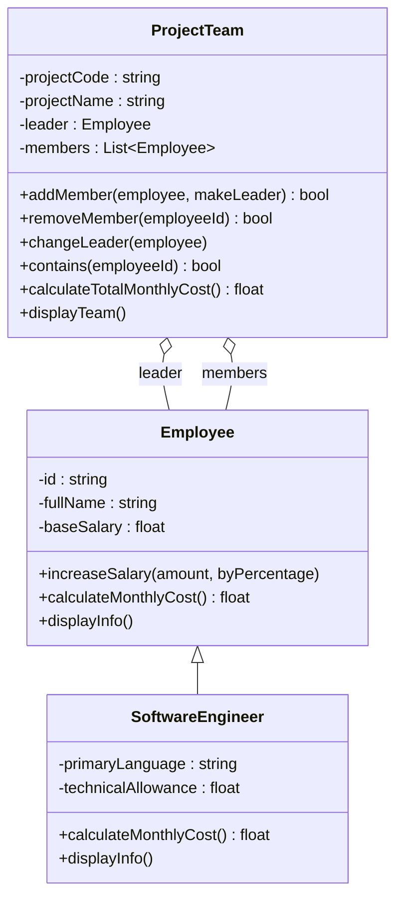

# Quản lý nhóm dự án và nhân sự

- Mã sinh viên: `202418853`
- Họ tên: `Nguyễn Quang Chiến`

Bài tập OOP (Employee / SoftwareEngineer / ProjectTeam)

## Cấu trúc file

```
oop_project/
├── employee.py           # Lớp Employee
├── software_engineer.py  # Lớp SoftwareEngineer (kế thừa Employee)
├── project_team.py       # Lớp ProjectTeam
├── main.py                # Kịch bản kiểm thử 15 bước
└── README.md
```

## Cách chạy

```bash
cd oop_project
python3 main.py
```

## Sơ đồ lớp



- `Employee <|-- SoftwareEngineer`: kế thừa công khai.
- `ProjectTeam o-- Employee`: liên kết tổng hợp (aggregation) - ProjectTeam
  chỉ giữ tham chiếu, không sở hữu vòng đời của Employee.

## Bất biến của mô hình

- Mã nhân sự (`id`) không rỗng.
- Lương cơ bản không âm.
- Không có hai thành viên cùng mã (`id`) trong một `ProjectTeam`.
- Trưởng nhóm (`leader`) luôn thuộc danh sách thành viên (`members`) của
  đúng nhóm đó.
- Không được xóa trưởng nhóm hiện tại khi chưa chỉ định trưởng nhóm thay thế
  (`removeMember` sẽ raise `ValueError`).

## Nạp chồng (overload) được mô phỏng bằng tham số mặc định / từ khóa

Python không hỗ trợ overload theo kiểu tham số như C++, nên mỗi "phiên bản"
constructor/phương thức trong đề bài tương ứng với một cách gọi khác nhau
của cùng một hàm:

| Yêu cầu đề bài | Cách gọi trong code |
|---|---|
| `Employee()` | `Employee()` |
| `Employee(id, fullName)` | `Employee("NV01", "Nguyen Van A")` |
| `Employee(id, fullName, baseSalary)` | `Employee("NV02", "Tran Thi B", 12_000_000)` |
| `increaseSalary(amount)` | `emp.increaseSalary(1_000_000)` |
| `increaseSalary(value, byPercentage)` | `emp.increaseSalary(10, byPercentage=True)` |
| `SoftwareEngineer(id, fullName, primaryLanguage)` | `SoftwareEngineer("KS01", "Le Van C", "Python")` |
| `SoftwareEngineer(id, fullName, baseSalary, primaryLanguage, technicalAllowance)` | `SoftwareEngineer("KS02", "Pham Thi D", baseSalary=15_000_000, primaryLanguage="C++", technicalAllowance=2_000_000)` |
| `ProjectTeam(projectCode, projectName)` | `ProjectTeam("PRJ01", "Du an chinh")` |
| `ProjectTeam(projectCode, projectName, leader)` | `ProjectTeam("PRJ02", "Du an phu", leader=emp1)` |
| `addMember(employee)` | `team.addMember(emp1)` |
| `addMember(employee, makeLeader)` | `team.addMember(se2, True)` |

## Kịch bản kiểm thử (`main.py`)

`main()` chạy tuần tự 15 bước theo đúng thứ tự trong đề bài: tạo hai
`Employee` và hai `SoftwareEngineer` bằng các constructor khác nhau, tăng
lương theo hai cách, tạo `ProjectTeam`, thêm/xóa/đổi trưởng nhóm, hiển thị
đa hình, và cuối cùng dùng một hàm con (`demo_scope_block`) để mô phỏng việc
hủy một `ProjectTeam` khi ra khỏi phạm vi, đồng thời chứng minh `Employee` dùng chung vẫn tồn tại sau
đó (do quan hệ aggregation không sở hữu).
