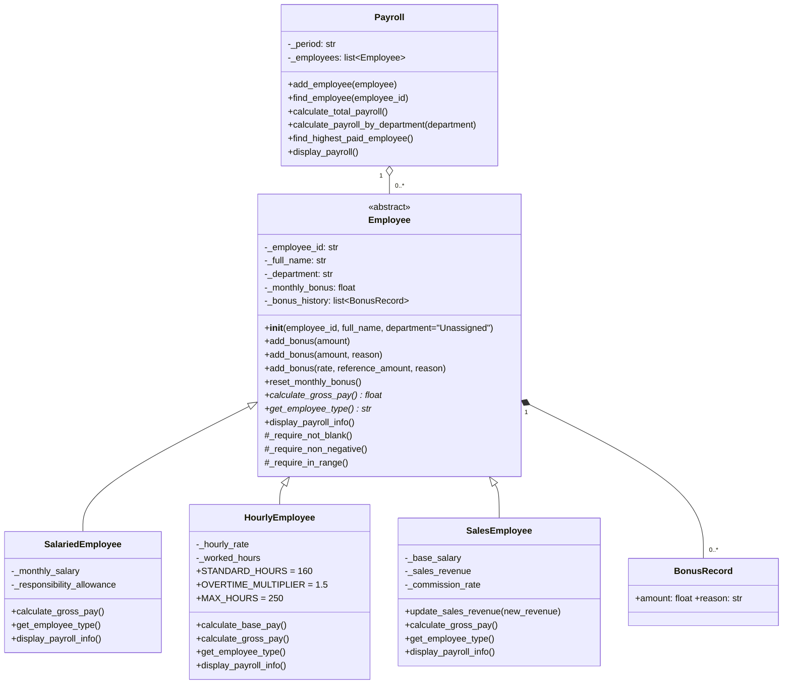

# Hệ thống tính lương và thưởng nhân sự 

Bài thực hành  – Lập trình hướng đối tượng
**Mã sinh viên:** 202418853 – **Họ tên:** Nguyễn Quang Chiến

## 1. Cấu trúc thư mục

| File | Nội dung |
|---|---|
| `employee.py` | `Employee` (lớp cơ sở trừu tượng), `BonusRecord`, `format_money` |
| `salaried_employee.py` | `SalariedEmployee` – lương cố định + phụ cấp + thưởng |
| `hourly_employee.py` | `HourlyEmployee` – theo giờ, giờ vượt 160 nhân 1,5 |
| `sales_employee.py` | `SalesEmployee` – lương cơ bản + hoa hồng + thưởng |
| `payroll.py` | `Payroll` – bảng lương một kỳ (không kế thừa `Employee`) |
| `main.py` | Chạy dữ liệu mẫu E001–E004 của đề |
| `test_payroll.py` | 47 ca kiểm thử (mẫu, biên, lỗi) bằng `unittest` |
| `test_output.txt` | Kết quả chạy kiểm thử thực tế |

## 2. Cách chạy

Yêu cầu Python 3.8+ (không cần cài thư viện ngoài).

```bash
python main.py                  # in bảng lương mẫu, tổng 70.000.000
python -m unittest -v           # chạy toàn bộ kiểm thử
```

## 3. Sơ đồ lớp



## 4. Lớp, trách nhiệm và bất biến

| Lớp | Trách nhiệm | Bất biến |
|---|---|---|
| `Employee` | Dữ liệu chung, quản lý thưởng, khai báo hành vi đa hình | id/họ tên/phòng ban không rỗng; thưởng ≥ 0 và bằng tổng lịch sử |
| `SalariedEmployee` | Tính lương cố định | lương ≥ 0, phụ cấp ≥ 0 |
| `HourlyEmployee` | Tính lương giờ, giờ vượt tính ra từ `worked_hours` | đơn giá ≥ 0; 0 ≤ giờ ≤ 250 |
| `SalesEmployee` | Lương cơ bản + hoa hồng, cập nhật doanh số có kiểm soát | lương ≥ 0, doanh số ≥ 0, 0 ≤ hoa hồng ≤ 0,3 |
| `Payroll` | Danh sách nhân sự một kỳ, tổng hợp, tìm kiếm | kỳ không rỗng; không trùng mã |

## 5. Nạp chồng trong Python

Python **không có nạp chồng theo chữ ký** (hàm định nghĩa sau ghi đè hàm trước), nên bài dùng các kỹ thuật tương đương:

- **Constructor nạp chồng** → tham số mặc định. `SalariedEmployee("E9", "An")` là constructor rút gọn (phòng ban `"Unassigned"`, lương/thưởng 0); truyền đủ tham số là constructor đầy đủ. Mọi kiểm tra nằm trong một `__init__` nên không lặp logic; lớp con gọi `super().__init__`.
- **`add_bonus()` nạp chồng** → một hàm phân phối theo số đối số, khai báo ba chữ ký bằng `typing.overload`:
  - `add_bonus(amount)` – thưởng cố định;
  - `add_bonus(amount, reason)` – thưởng cố định kèm lý do;
  - `add_bonus(rate, reference_amount, reason)` – thưởng theo tỷ lệ (`reason` có thể truyền bằng từ khóa).
  Ba nhánh cùng dồn về `_apply_bonus()`. Sai số đối số hoặc sai kiểu ném `TypeError`; sai giá trị ném `ValueError`. Việc chọn nhánh diễn ra **lúc chạy** (khác C++ là lúc biên dịch).

## 6. Quyết định thiết kế

1. **`calculate_gross_pay()` là ghi đè (override), không phải nạp chồng**: cùng tên, cùng tham số, hành vi theo kiểu thật của đối tượng; `Payroll` chỉ gọi qua kiểu chung `Employee`, không `if/else` theo loại.
2. **`Employee` là lớp trừu tượng** (`ABC` + `@abstractmethod`): không có công thức lương cho "nhân sự chung chung", và `Employee(...)` trực tiếp ném `TypeError`.
3. **`Payroll` lưu tham chiếu đối tượng** (list + dict theo mã). Python luôn lưu tham chiếu nên không bị slicing như C++ khi lưu theo giá trị; dict giúp kiểm tra trùng mã và tra cứu O(1).
4. **Lưu lịch sử thưởng** bằng `BonusRecord` (dataclass bất biến) trong một list, đồng thời giữ tổng `_monthly_bonus`. Kế toán truy vết được từng khoản và lý do; tránh danh sách song song. Chỉ `_apply_bonus()` và `reset_monthly_bonus()` được sửa hai biến này.
5. **Nếu nhân viên kinh doanh cũng được trả theo giờ**: kế thừa đơn không còn phù hợp; nên dùng hợp thành (composition): tách thành phần lương (giờ, hoa hồng…) rồi `Employee` chứa danh sách thành phần.
6. **`calculate_total_payroll()` không nên là static**: kết quả phụ thuộc trạng thái từng bảng lương (`self._employees`), static không có `self`.
7. **Thêm `ContractEmployee`**: chỉ tạo lớp mới kế thừa `Employee` và ghi đè ba hàm đa hình; `Payroll` và các lớp cũ không phải sửa.
8. Dùng ngoại lệ ngay trong constructor/setter nên không tồn tại đối tượng sai trạng thái; thuộc tính đều có dấu `_` đầu và chỉ đọc qua `@property`.

## 7. Kết quả kiểm thử

`python -m unittest -v` → **47/47 ca đạt** (xem `test_output.txt`). Gồm: 4 nhân sự mẫu và tổng/phòng ban/người cao nhất; biên 0/160/250/251 giờ; hoa hồng 0, 0,3, 0,31; `add_bonus` với các biên `rate = 0 / 0,5 / 0,51`, lý do rỗng, số tiền ≤ 0; trùng mã; bảng lương rỗng.

## 8. Yêu cầu giải thích (C.1)

### 8.1 Phiên bản `add_bonus()` nào được chọn trong từng lời gọi và vì sao?

| Lời gọi | Nhánh được chọn | Lý do |
|---|---|---|
| `e.add_bonus(1_000_000)` | `(amount)` – thưởng cố định | có 1 đối số |
| `e.add_bonus(500_000, "Hoàn thành dự án")` | `(amount, reason)` | có 2 đối số, đối số thứ hai là chuỗi |
| `e.add_bonus(100, reason="x")` | `(amount, reason)` | `reason` truyền bằng từ khóa được ghép vào danh sách đối số → 2 đối số |
| `e.add_bonus(0.02, 50_000_000, "Thưởng theo tỷ lệ")` | `(rate, reference_amount, reason)` | có 3 đối số → thưởng = 0,02 × 50.000.000 = 1.000.000 |
| `e.add_bonus(0.1, 1000)` | `TypeError` | 2 đối số nhưng đối số thứ hai không phải chuỗi → mơ hồ, từ chối |
| `e.add_bonus()` / 4 đối số | `TypeError` | không khớp chữ ký nào |

### 8.2 Chọn phương thức nạp chồng diễn ra lúc biên dịch hay lúc chạy?

**Lúc chạy.** Python là ngôn ngữ thông dịch, không có bước biên dịch chọn hàm theo chữ ký. Thân `add_bonus(*args, reason=None)` đếm số đối số (`len(args)`) rồi gọi `_add_fixed_bonus` hoặc `_add_rate_bonus`. Ba khai báo `@overload` chỉ là gợi ý kiểu cho IDE và `mypy`, **không có tác dụng lúc chạy**. (Khác C++: trình biên dịch chọn phiên bản theo số lượng và kiểu đối số ngay lúc biên dịch, liên kết tĩnh.)

### 8.3 Việc chọn `calculate_gross_pay()` của lớp dẫn xuất diễn ra như thế nào?

Cũng **lúc chạy**, theo kiểu thật của đối tượng (liên kết động). Trong Python mọi phương thức đều "ảo" theo mặc định: khi `Payroll` gọi `e.calculate_gross_pay()`, trình thông dịch tra tên phương thức trong lớp thật của `e` (thứ tự MRO: `SalesEmployee` → `Employee` → `object`) và chạy phiên bản đầu tiên tìm thấy. `@abstractmethod` ở `Employee` buộc lớp con phải ghi đè mới tạo được đối tượng. Nhờ vậy các hàm tổng hợp trong `Payroll` không cần `if/else` hay `isinstance` theo loại nhân sự.

### 8.4 Nếu thay danh sách `Employee` bằng nhiều danh sách riêng cho từng loại?

`Payroll` phải có ba danh sách (`_salaried`, `_hourly`, `_sales`) và `add_employee` phải phân loại bằng `isinstance` để bỏ đúng danh sách. Mọi phép tổng hợp (tổng, theo phòng ban, người cao nhất, hiển thị) phải duyệt cả ba danh sách (ví dụ `chain(...)`); kiểm tra trùng mã phải kiểm tra qua cả ba nơi; thứ tự thêm vào bị mất khi hiển thị. Đa hình hầu như không còn tác dụng, và mỗi loại mới (như `ContractEmployee`) đòi thêm danh sách rồi sửa mọi hàm tổng hợp, vi phạm nguyên tắc mở–đóng (Open/Closed). Thiết kế một danh sách kiểu `Employee` tránh được toàn bộ điều này.

### 8.5 Khi thêm `ContractEmployee`, phần mã nào phải sửa, phần nào không nên sửa?

- **Phải làm:** tạo `contract_employee.py` với lớp `ContractEmployee(Employee)` có dữ liệu riêng, `__init__` kiểm tra bất biến mới, ghi đè `calculate_gross_pay()`, `get_employee_type()`, `display_payroll_info()`; thêm dòng khởi tạo trong `main.py`/test và ca kiểm thử mới.
- **Không nên phải sửa:** `Payroll`, `Employee`, `SalariedEmployee`, `HourlyEmployee`, `SalesEmployee`. `Payroll` chỉ phụ thuộc kiểu chung `Employee` nên tự nhận loại mới. Phải sửa các lớp này nghĩa là thiết kế đã bị rò rỉ logic theo loại.
